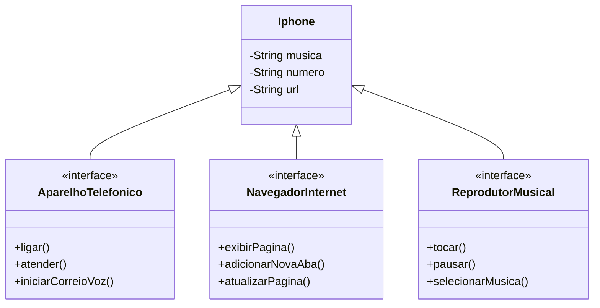

# desafio-poo

## Desafio de orientação objetos java DIO

**Modelar e diagramar a representação UML do componente iPhone, abrangendo suas funcionalidades como Reprodutor Musical, Aparelho Telefônico e Navegador na Internet.**

**Modelagem realizada com base no vídeo de apresentação do primeiro Iphone, lançado em 2007**

## Entendendo modelo de classes 

**Conforme informado por Steve Job ele apresentou para o publico um Ipod(Reprodutor Musical), Celular(Aparelho Telefônico) e Comunicador de Internet(Navegador na Internet). Mas não seriam três produtos separados que seriam apresentados naquele dia e sim um só, O Iphone.**

**Com base nisso foi criado o diagrama de classes a seguir. Onde o Iphone, representado por uma classe, implementa três interfaces: Reprodutor Musical, Aparelho Telefônico e Navegador na Internet. Dessa forma, para o Iphone poussui a caracteristica do Ipod ele deve obrigatóriamente possuir as mesma propriedades do Ipod, a mesma situação se aplica aos outros duas funcinalidades. Nesse caso foram implementadas 3 interfaces pois dessa forma a Classe obrigatoriamente deve possuir os métodos das interface, porém o comportamento desses métodos serão determinados pela classe Iphone.**

